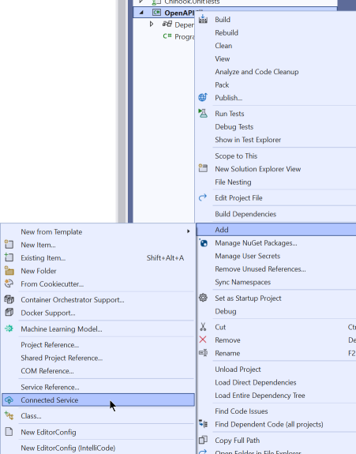

# Consuming ASP.NET Web API with OpenAPI Document

## CREATE NEW CONSOLE PROJECT

```dos
dotnet new console --name OpenAPIClient
```

## GET SWAGGER DOC FROM YOUR WEB APIs

### Run your Web API


## ADD OPENAPI CONNECTED SERVICE TO PROJECT




## WRITE CODE TO USE OPENAPI

```csharp
using ChinookOpenAPI;

using var httpClient = new HttpClient();

var apiClient = new ChinookOpenAPIClient("https://localhost:7011/", httpClient);

var genres = await apiClient.GenreAllAsync(1, 20, "");

if (genres != null)
    foreach (var genre in genres)
    {
        Console.WriteLine(genre.Name);
    }
Console.ReadLine();
```


